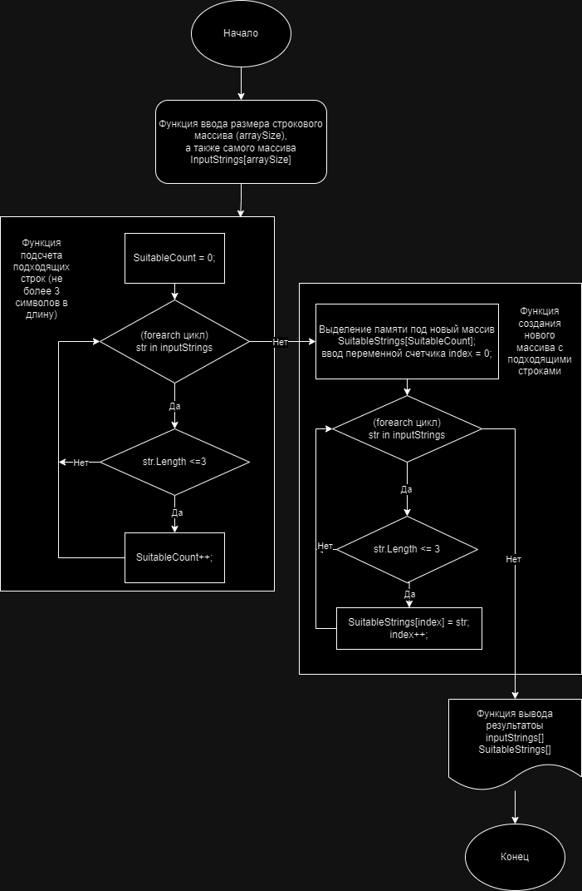

# Поставлена задача:

Создать программу, которая из имеющегося массива строк формирует массив из строк, длина которых меньше либо равна 3 символам. При этом первоначальный массив можно ввести с клавиатуры, либо задать на страрте выполнения алгоритма. При решении не рекомендуется пользоваться коллекциями. Рекомендуется обойтись исключительно массивами.

## Алгоритм решения задачи. Описание:

Чтобы решить поставленную задачу, используются следующие методы:

*Main метод* - точка входа, координация выполнения программы.
*RequestArraySize* - запрос у пользователя размер массива.
*ReadInputStrings* - чтение строк, введение пользователем; сохранение в массиве.
*FilterStrings - фильтрация строк; остаются те, которые подходят по условию задачи (длина меньше или равно 3 символам).
*CountSuitableStrings* - подсчет количества подходящих строк в массиве.
*DisplayResults* - вывод исходного и отфлильтрованного массивов на экран.

### Пошаговое решение задачи. Описание:

1. Запрос размера массива строк у пользователя
2. Вводы данных пользователем и сохранение в массиве
3. Подсчет подходящих строк (длина не более 3 символов)
4. Выделение памяти под новый массив с подходящими строками
5. Выполнение нового массива подходящими строками
6. Вывод результатов: [Исходный массив строк] и [Новый массив с подходящими строками]

## Выполнение условий задачи?

В данном решении не используются коллекции, как было обговорено в условии задачи. Код работает только с массивами:

```csh
string[] inputStrings
``` 

а также 

```csh
string[] SuitableStrings
``` 

Блок-схема с решением отображена ниже на рисунке


